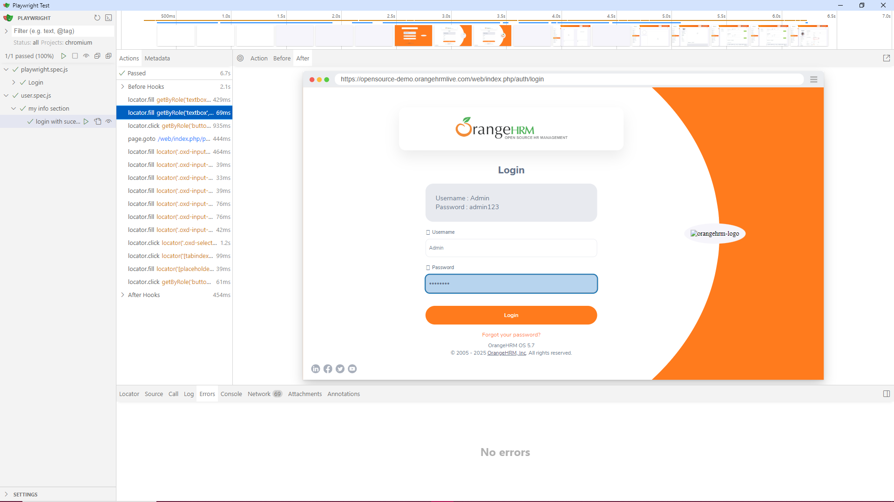

# Automação Playwright JavaScript Orange HRM 




Automação E2E com Playwright para o sistema OrangeHRM, utilizando a arquitetura Page Objects. Testes implementados para os cenários de Login, Dashboard e My Info, com foco em escalabilidade e manutenção fácil. O projeto demonstra boas práticas em automação de testes e estruturas reutilizáveis, garantindo eficiência e qualidade.

## ⚙️ Installar


## ✅ Pre Requisitos

> **💡 NOTA:**
> 
> È necessário ter o [Node.js](https://nodejs.org)  Instalado


## 📝 Passo a Passo para Instalação


**1.** **Clone o repositório na sua maquina 🖥️**

```bash
git clone https://github.com/ElizabethGomes-QAEngineer/Playwright.git
```

**2.** **Navegue até o diretório do projeto 📂**

```bash
cd workspace-playwright
````


**3.** **Instale as dependências do projeto 📦**

```bash
npm install 
```

**4.** **Instale Playwright  🛠️**

```bash
npx init playwright
```

**ou utilize**

```bash
npx create-playwright
```


**4.** **Execute o Cypress para rodar os testes 🚀**

abrir o Playwright com interface gráfica 

```bash
npx playwright test --ui
```

executar no modo headless (sem interface gráfica)

```bash
npx playwright test
```

**6.** **Execute os Resultados**

```bash
npx playwright show-report
```


